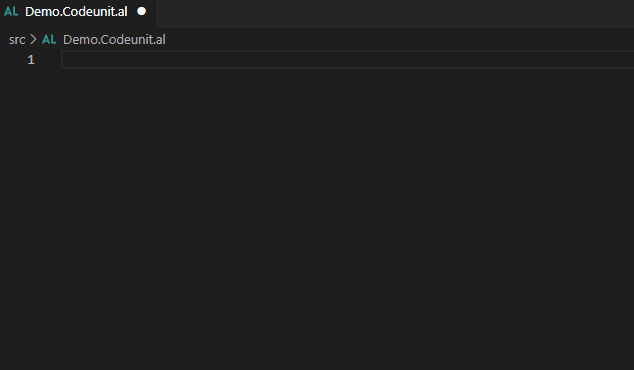
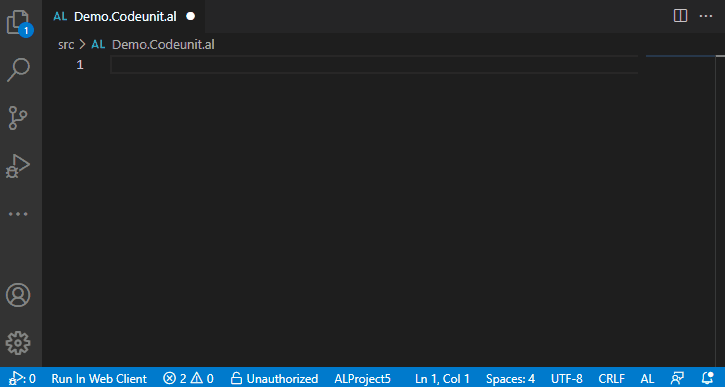
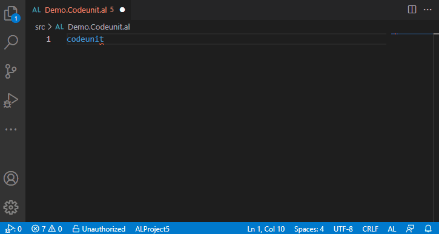
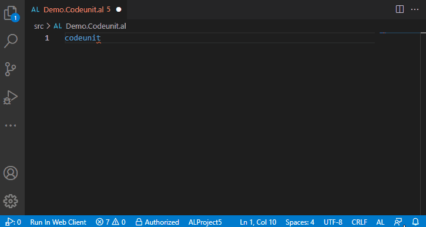
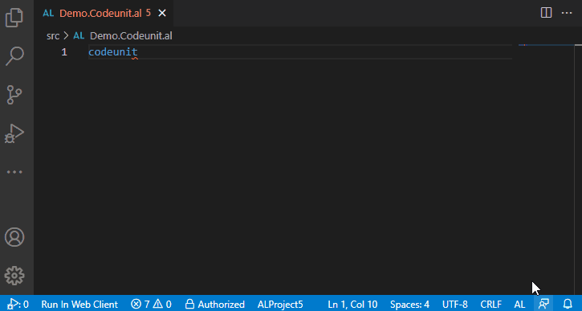

# AL Object ID Ninja

Zero-configuration, dead-simple, no-collision object ID assignment for multi-user repositories.

## Why do I need this extension?

Object ID collisions are a reality of every AL development team. Sooner or later two developers will assign
the same object ID to different objects they create. In the best case, this causes manual renumbering work.
In the worst case you have a broken build.

AL Object ID Ninja solves this problem. It uses a central object ID cache that keeps track, in real time,
of all object IDs your team members assigned to their objects. Unlike the AL Language, AL Object ID Ninja
will never suggest the same object ID to developers working on the same app at the same time.

While the AL extension doesn't see that codeunit ID `50108` is already assigned by another developer,
AL Object ID Ninja sees it. Also, AL Object ID Ninja sees that somebody even assigned `50109` while 
IntelliSense dropdown was open, so you only get to assign ID `50110`. No more object ID collisions.

## Business as usual

The most beautiful part about AL Object ID Ninja is not that it just works out of the box without
any configuration. It's actually that you don't need to change anything about how you are assigning
object IDs! You keep using IntelliSense and you keep accepting the first suggestion there, and that's
all.

> AL Object ID Ninja does not replace the object ID suggestions made by AL. It just put its own
suggestions on top of those made by AL.

## Getting started

To get started, you download this extension and start using it. It's that simple! No configuration is
needed, and you can use it on your existing projects as well as the new ones without any limitations.

While AL Object ID Ninja back end requires some information to be available before it can start
assigning new IDs to your team, it will synchronize this information for you automatically.

That's it! Now everyone on your team can assign objects ID without fear of collision.

## How does this AL Object ID Ninja do this?

AL Object ID Ninja uses Azure serverless back end to coordinate object ID assignment across your team.
When you request an object ID from IntelliSense, AL Object ID Ninja will ask the back end for the next
available number. When you accept the suggestion from IntelliSense, it commits the number to the back
end so that nobody else will receive that suggestion.

The information this extension exchanges with the back end is minimal. It only sends this:
* `id` from `app.json`. This is needed so the back end can track assignment per app.
* `idRanges` from `app.json`. This is needed so that the back end can know which object IDs are
available for assignment.
* Type of the object for the ID is needed.
* User name of the developer who requested it. This is only needed for notifications, and you can switch
this one off if you don't like your name to be shared.

## Features

Here's what AL Object ID Ninja can do.

### Automatic assignment of object IDs.

Object IDs are assigned through the back end in two steps. First, when you trigger IntelliSense, the
extension does a soft fetch of the next available object ID for that object type. The soft fetch
retrieves the next available number, but does not record that number as assigned yet.

If you reject the suggestion, nothing happens. Your soft-fetched object ID is not marked as
assigned. It will be suggested to the next person who invokes IntelliSense to auto-suggest the next
available object ID number.

When you accept the IntelliSense suggestion, two things happen. First, IntelliSense inserts the
soft-fetched object ID. But then AL Object Ninja hard fetches the next available object ID from the
back end. The hard fetch both retrieves the next available number, and commits it to the back end
cache. Then, if the hard-fetched object ID is different than the soft-fetched object ID, AL Object
Ninja replaces the object ID in the code with the hard-fetched one.

Seriously. No object ID collisions will happen as long as everyone on your team is using AL Object
ID Ninja.

### Notifications of assignment made by other users

Whenever another user assigns an object ID from AL Object ID Ninja, everyone working on the same
app at that time receives notifications.

> Note: You can switch the notifications off in your settings.

### Synchronization of previously assigned object IDs

You can synchronize object IDs between the repository and the back-end cache. Objects can go out
of sync naturally by developers occasionally deleting existing objects from the repository; or
accidentally by developers accidentally assigning ID multiple times for the same object. You can
synchronize objects at any time your branch is in sync with all other branches (meaning there
are no active branches on which developers have new objects not yet merged into mainline).

> Note: Automatic detection of object deletion and automatic releasing of freed-up object IDs
is currently in development and will be included in the next version.

Learn more about synchronization: https://github.com/vjekob/al-objid/tree/master/doc/Synchronization.md

### App authorization 

For AL Object ID Ninja to work out of the box without any configuration for every AL developer in
the world, the communication must happen over public API endpoints. While all communication happens
securely over HTTPS, anyone can communicate with the same back end and exchange the same content as
you. This makes it possible for malicious users to launch a kind of a denial-of-service attack
against your development team, and make your object ID assignment unreliable by syncing fake
object ID assignment information.

AL Object ID Ninja has a simple security mechanism to prevent that: App Authorization. You can
authorize your app with the back end and receive your own per-app authorization key.

Once an app is authorized, every request it makes must include this authorization key and back end
will reject any requests made without or with an invalid authorization key.

You can revoke existing authorization keys and request new ones at any time.

Learn more about authorization: https://github.com/vjekob/al-objid/tree/master/doc/Synchronization.md

### Making it extra secure: configuring your own back end

The extension uses public Azure Functions endpoints for communication with the back-end service.
You don't need to configure anything. However, it's okay to be concerned about your information
being shared over a publicly available API.

While AL Object ID Ninja does not expose any of your sensitive information, since this is a
public service, you may want to use your own back end instead. This is possible. In that case, do this:
1. Deploy the Azure Functions application from the `backend` directory onto your own Azure subscription.
2. Configure the back-end URL and back-end key in your Visual Studio Code settings.

## Upcoming features

These features are planned for future versions:
* Up-to-date information about current object through status bar. You will be able to see if the
object you are working on is using a properly recorded ID assignment.
* Automatic fixes of various out-of-sync situations.
* Warnings when object IDs are about to run out. Wouldn't it be great for you to know when you are
only a few more codeunits away from your range being completely used up?
* Testability. Duh! I wanted to get this extension out to the world as soon as possible. Not that
this is actually a feature, but for all you purists out there, it's coming.

## Special thanks

Special thanks to [waldo](https://twitter.com/waldo1001) who brainstormed this extension with me
and tested the snot out of it.
