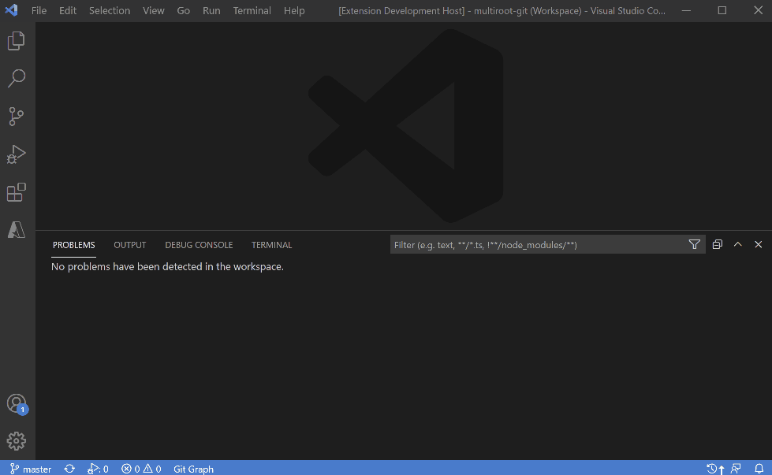
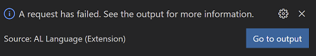

# Automatic Synchronization

[Synchronization of object IDs](https://github.com/vjekob/al-objid/tree/master/doc/Synchronization.md) is
a necessary step to start using AL Object ID Ninja. However, when your workspace contains many individual
apps in a multi-root configuration, or when there are many branches that together contain all information
about your object IDs, then synchronizing such workspaces manually may take a lot of time and is prone to
error.

To help you with this problem, AL Object ID Ninja offers the auto-synchronization feature. It can read all
object IDs used by all apps in your workspace and iterate through all your branches for all Git repos you
have in your workspace, and then synchronize all the apps correctly in one single go.

This saves a lot of time and eliminates the human error factor.

## How to run automatic synchronization?

To run automatic synchronization, run the `Vjeko: Automatically Synchronize Object IDs for Entire Workspace`
from the command palette. It will first ask you the following:

## Fully automated synchronization

If you don't want to answer any questions during the automatic synchronization process for your workspace,
then you can choose this option.

When you choose this option, AL Object ID Ninja will synchronize all workspace folders (in a multi-root
workspace), and will use all Git branches. It will correctly identify the app each folder and each branch
belongs to, then it will check out into each branch, collect information about consumed object ID and will
then synchronize all of this information in one call to the back end.

For Git branches, it will use all local and remote branches like this:

1. If a local branch tracks a remote branch, and local branch is **ahead** of remote branch, then it will
   use the local branch.
2. If a local branch tracks a remote branch, and local branch is **behind** remote branch, then it will
   use the remote branch.
3. If a local branch tracks a remote branch, and local branch is **both ahead and behind** (this is when
   you have commits in local that are not present in remote, and commits in remote that are not present in
   local), then it will use both local branch and remote branch.
4. If a local branch does not track any remote branches, then local branch is used.
5. If a remote branch is not tracked by any local branches, then remote branch is used.
6. For each remote branch, regardless of if it's tracked by a local branch or not, AL Object ID Ninja
   will set up a new temporary local branch that tracks it, then it will check out into this temporary
   branch, do the synchronization, and then remove the temporary branch.

When this process finishes, AL Object ID Ninja will check out into the same branch from where you started
the process.

## Interactive automated synchronization

If you want to take full control of automated synchronization, then choose this option.

When you choose this option, AL Object ID Ninja will ask you these questions, in this order:

1. Which workspace folders you want to synchronize. You can select the folders you want synchronized, and
   omit those that you don't want to synchronize.
2. Then, it will identify all Git repos to which specified workspace folders belong. Remember, the
   relationship between Git repositories and workspace folders is not necessarily one-to-one, but can be
   one-to-many. AL Object ID Ninja will correctly identify Git repos and their relationships to workspace
   folders.
3. Once Git repos and their relationships to workspace folders is identified, AL Object ID Ninja will
   retrieve all branch information. Then it will present you with the choice of branches. It will indicate
   if a local branch tracks a remote branch, and whether the local branch is ahead, behind, or both, with
   respect to the remote branch.
4. When you choose which branches you want to synchronize, AL Object ID Ninja will ask you about any
   branches where different information exists in local branch than in the remote branch it tracks. For all
   such branches, you will have to choose whether to use local branch or remote branch. When a local branch
   is both ahead and behind the remote branch, then you will also have an option to synchronize both the
   local and the remote branches.

Once AL Object ID Ninja collects all this information, it will check out into each branch you specified,
then collect the object ID information, and then synchronize. To synchronize remote branches, AL Object ID
Ninja will create new temporary local branches that track those remote branches, and will delete those
temporary branches once it collects all object IDs from them.

## I am receiving AL errors while auto-synchronizing. What does it mean, and what should I do?

Sometimes, while auto-synchronizing, you will receive this AL error:

The reason this error happens is that whenever AL Object ID Ninja switches into a branch, the AL Language
extension detects the change in the workspace content and starts loading the files. However, AL Object ID
Ninja will often switch to another branch faster than AL Language can load the files. This causes the AL
Language to fail, and it shows the error message.

You can safely ignore this error message. It will not interfere with the synchronization process. If you
see this error, simply restart VS Code after synchronization is completed.
